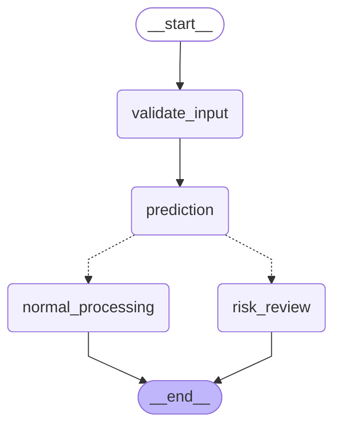

# AgentOps LangGraph Workflow

```mermaid
---
config:
  flowchart:
    curve: linear
---
graph TD;
	__start__([<p>__start__</p>]):::first
	validate_input(validate_input)
	prediction(prediction)
	risk_review(risk_review)
	normal_processing(normal_processing)
	__end__([<p>__end__</p>]):::last
	__start__ --> validate_input;
	prediction -.-> normal_processing;
	prediction -.-> risk_review;
	validate_input --> prediction;
	normal_processing --> __end__;
	risk_review --> __end__;
	classDef default fill:#f2f0ff,line-height:1.2
	classDef first fill-opacity:0
	classDef last fill:#bfb6fc

```
